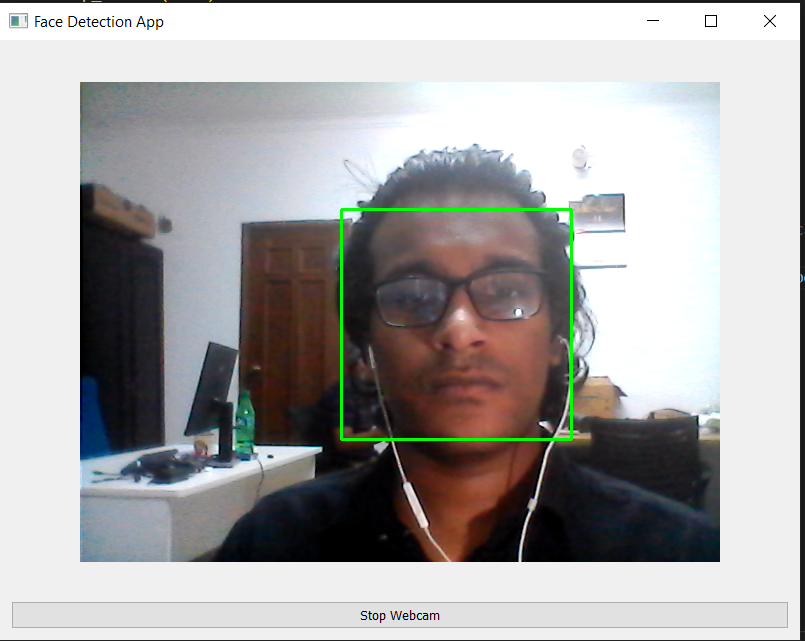

# Face Detection from Webcam using PyQt5 and OpenCV (MVC Architecture)

## Overview

This Python application allows you to detect faces in real-time from a webcam using the PyQt5 library for the graphical user interface and OpenCV for face detection. It features a simple graphical user interface with a "Start Webcam" button to toggle the webcam feed and display live face detection.

## Table of Contents

- [Components](#components)
- [Usage](#usage)
- [Requirements](#requirements)
- [Important Notes](#important-notes)
- [Credits](#credits)

## Components

1. **Model**:
   - **Responsibility**: The Model component represents the application's data and core logic. In this case, it's responsible for webcam access, video capture, and face detection.
   - **Implementation**:
     - The `Model` class encapsulates webcam-related functionality.
     - `start_webcam()` initializes and starts the webcam feed using OpenCV's video capture capabilities.
     - `stop_webcam()` stops the webcam feed and releases the video capture when the user decides to stop capturing video.
     - `detect_faces()` is responsible for capturing frames from the webcam, detecting faces in each frame, and processing the results.

2. **View**:
   - **Responsibility**: The View component is responsible for the user interface and presenting data to the user.
   - **Implementation**:
     - The `View` class is responsible for creating the GUI using PyQt5.
     - It defines the layout and contains a label for displaying the captured frames.
     - The `display_frame(frame)` method updates the label with the current frame that contains detected faces.
     - The `toggle_webcam()` method is called when the "Start Webcam" button is clicked. It toggles the webcam feed and updates the button text accordingly.

3. **Controller**:
   - **Responsibility**: The Controller component acts as an intermediary between the Model and View. It handles user input and controls the flow of data.
   - **Implementation**:
     - In the provided code, the Controller is not explicitly defined as a separate class. Instead, the Controller's role is shared between the `Model` and `View` classes.
     - The main functionality of starting and stopping the webcam feed is controlled by the `toggle_webcam()` method in the `View` class. This method interacts with the Model to initiate and terminate the webcam feed.

In this implementation:

- The View class takes user input (e.g., clicking the "Start Webcam" button) and communicates with the Model to start and stop the webcam feed.
- The Model handles the low-level webcam access, captures frames, performs face detection, and provides the processed data (frames with detected faces) to the View.
- The View class updates the graphical user interface with the data received from the Model.

## Usage

1. Run the application.
2. Click the "Start Webcam" button to start the webcam feed and real-time face detection.
3. Click the button again to stop the webcam feed.

## Requirements

- Python 3.x
- PyQt5: You can install it using pip: `pip install PyQt5`
- OpenCV (cv2): Install it with pip: `pip install opencv-python`

## Important Notes

- The `toggle_webcam` method in the View class is responsible for starting and stopping the webcam feed. Adjust the timer interval in the Model class if needed to control the frame capture rate.
- Ensure that you have a working webcam and OpenCV correctly installed on your system for real-time face detection.

## Credits

This code is based on the original code provided by the user, modified to enable real-time face detection from a webcam. The original code was adapted to this specific use case.

For a more detailed explanation and code implementation, please see the [Python code](FaceDetection_Local.py) in this repository.
